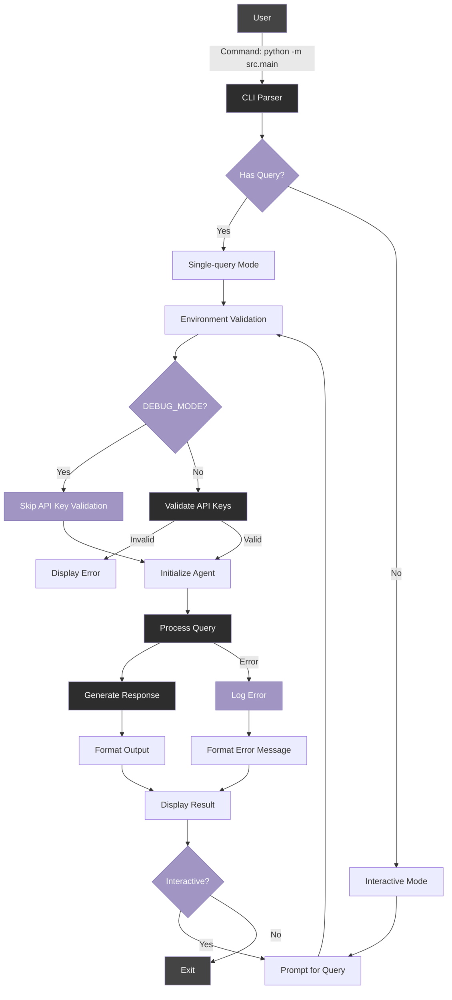

# Command Line Interface (CLI)

## Purpose

The Command Line Interface (CLI) serves as the primary user interaction method for the Marketing Analyst Agent, providing direct access to the agent's capabilities through a simple, text-based interface. It enables users to submit marketing analysis queries and receive comprehensive responses without requiring integration with external applications.

## Detailed Description

The CLI implementation offers two operational modes:

1. **Single-query mode** - Process a one-time query provided as a command-line argument
2. **Interactive mode** - Start a persistent session where users can submit multiple queries

The interface parses user inputs, configures the agent settings, validates the environment, and returns formatted responses directly in the terminal. It serves as the main entry point to the Marketing Analyst Agent's capabilities, handling everything from basic setup to response generation.

## Architecture



## Implementation Details

The CLI is implemented in `src/main.py`, which serves as the entry point to the application. It handles:

1. **Argument parsing** - Processing command-line arguments through argparse
2. **Environment validation** - Checking for required settings and API keys
3. **Agent initialization** - Setting up the Marketing Analyst Agent with appropriate configuration
4. **Query execution** - Sending user queries to the agent and handling responses
5. **Interactive session management** - Maintaining a continuous session for multiple queries
6. **Error handling** - Gracefully managing and reporting errors
7. **Output formatting** - Presenting results in a readable, well-formatted manner

### Command-line Arguments

| Argument       | Description                     | Default                          |
| -------------- | ------------------------------- | -------------------------------- |
| `--query`      | The query to process            | None (triggers interactive mode) |
| `--model`      | OpenAI model to use             | From `DEFAULT_MODEL` setting     |
| `--no-tracing` | Disable LangSmith tracing       | Tracing enabled                  |
| `--verbose`    | Enable verbose output           | Disabled                         |
| `--highlight`  | Terms to highlight in responses | None                             |

## Usage Examples

### Single-query Mode

Process a one-time query and exit:

```bash
# Basic market trend analysis
python -m src.main --query "What are the key trends in the mobile gaming market for Q1 2023?"

# Competitor analysis with specific model
python -m src.main --model gpt-4 --query "Compare our product X with competitor products Y and Z"

# Generate a marketing report with verbose output
python -m src.main --verbose --query "Generate a detailed report on consumer sentiment for our latest product launch"

# Disable tracing for sensitive queries
python -m src.main --no-tracing --query "Analyze potential weaknesses in our marketing strategy"

# Highlight specific terms in the response
python -m src.main --query "Analyze mobile gaming market trends" --highlight "growth" "revenue" "engagement"
```

### Interactive Mode

Start an interactive session for multiple queries:

```bash
# Basic interactive mode
python -m src.main

# Interactive mode with specific model
python -m src.main --model gpt-4

# Interactive mode with highlighting
python -m src.main --highlight "market share" "competitors" "growth"

# Verbose interactive mode
python -m src.main --verbose
```

## Error Handling

The CLI implements robust error handling to manage:

1. **Missing API keys** - When not in DEBUG_MODE and required keys are missing
2. **Invalid queries** - When queries cannot be processed
3. **Agent errors** - When the agent encounters issues during processing
4. **Keyboard interrupts** - Graceful exit when the user interrupts execution

## Output Formatting

The CLI uses utilities from `src/utils/formatting.py` to format responses for better readability:

1. **Text formatting** - Improved spacing, line breaks, and paragraph organization
2. **Term highlighting** - Highlighting of important terms specified by the user
3. **Table formatting** - Structured display of tabular data when available

## Best Practices

1. **Use interactive mode** for exploration and multiple related queries
2. **Use single-query mode** for automation or when integrating with scripts
3. **Enable verbose output** when troubleshooting or when detailed processing information is needed
4. **Use DEBUG_MODE** during development to bypass API key requirements
5. **Prefer specific queries** that clearly indicate the desired analysis for best results
6. **Use highlighting** to emphasize important terms in long responses
