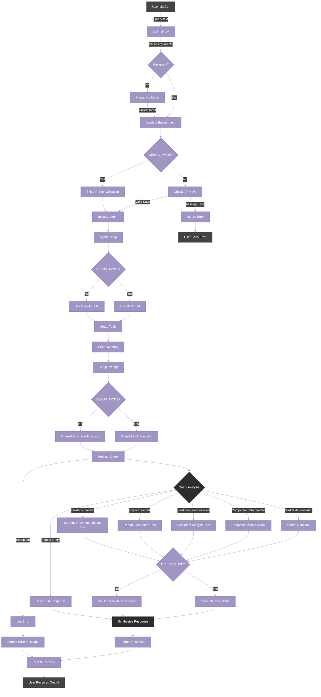

# Data Flow Architecture

## Description

This document visualizes the complete data flow through the Marketing Analyst Agent, from initial user input to final response output. Understanding this flow is crucial for developers working on enhancing or debugging the system, as well as for users who want to understand how their queries are processed.

## Purpose

The purpose of this data flow documentation is to:

1. Provide a clear visualization of how data moves through the system
2. Identify key processing steps and decision points
3. Illustrate how different components interact
4. Help with debugging by showing where issues might occur
5. Serve as a reference for understanding the agent's behavior

## End-to-End Data Flow



## Data Flow Steps Explanation

### 1. Input Reception

The system receives user input through the Command Line Interface (CLI), processing queries through `src/main.py`.

### 2. Input Processing

- **CLI Processing**:
  - Parses command-line arguments
  - Determines if running in single-query or interactive mode
  - If in single-query mode, processes the query provided via command-line argument
  - If in interactive mode, prompts the user for input
  - Validates environment variables

### 3. Environment Validation

- Checks if DEBUG_MODE is enabled
- If not in DEBUG_MODE, validates required API keys
- Returns error if validation fails and DEBUG_MODE is disabled

### 4. Agent Initialization

- Sets up the MarketingAnalystAgent instance
- Configures the language model (real or mock based on DEBUG_MODE)
- Initializes tools, memory, and prompt templates

### 5. Query Processing

- Executes the query using the agent executor
- Agent analyzes the query to determine which tools are needed
- For simple queries, may generate a direct response without tool use

### 6. Tool Execution

- Selected tools process the user query
- In DEBUG_MODE, tools generate mock data
- In normal mode, tools may call external APIs or services

### 7. Response Generation

- Synthesizes final response using tool outputs and LLM
- Formats response for console output
- Handles any exceptions that occurred during processing

### 8. Output Delivery

- Prints response to console
- In interactive mode, prompts for the next query
- Provides error message if query processing failed

## Code Examples

### CLI Input Processing

```python
# From src/main.py
def main() -> int:
    # Parse command line arguments
    args = parse_arguments()

    # Validate environment
    if not validate_environment():
        return 1

    # Initialize the agent
    agent = MarketingAnalystAgent(
        model_name=args.model,
        enable_tracing=not args.no_tracing,
        verbose=args.verbose
    )

    # Run query or interactive mode
    if args.query:
        response = agent.run(args.query)
        print(response["response"])
    else:
        run_interactive_mode(agent)
```

### Interactive Mode

```python
# From src/main.py
def run_interactive_mode(agent: MarketingAnalystAgent) -> None:
    """
    Run the agent in interactive mode.

    Args:
        agent: The marketing analyst agent instance
    """
    print("\n===== Marketing Analyst Agent (Interactive Mode) =====")
    print("Enter your queries and get marketing insights.")
    print("Type 'exit', 'quit', or 'q' to exit.")
    print("=================================================\n")

    while True:
        try:
            query = input("\nEnter your query: ")

            if query.lower() in ["exit", "quit", "q"]:
                print("Exiting...")
                break

            if not query.strip():
                continue

            print("\nProcessing query...")
            response = agent.run(query)

            print("\nResponse:")
            print(response["response"])

        except KeyboardInterrupt:
            print("\nExiting...")
            break
        except Exception as e:
            logger.error(f"Error processing query: {str(e)}")
            print(f"\nAn error occurred: {str(e)}")
```

### Query Processing

```python
# From src/agents/marketing_analyst.py
def run(self, input_text: str) -> Dict[str, Any]:
    """Run the agent on the given input."""
    try:
        # Run the agent
        response = self.agent_executor({"input": input_text})
        return {
            "response": response["output"],
            "success": True
        }
    except Exception as e:
        logger.error(f"Error running agent: {str(e)}")
        return {
            "response": f"An error occurred: {str(e)}",
            "success": False
        }
```

## CLI Usage Examples

The Marketing Analyst Agent can be used through the command line in the following ways:

### Single Query Mode

```bash
# Basic query
python -m src.main --query "Analyze market trends in the mobile gaming industry"

# With model specification
python -m src.main --model gpt-4 --query "What is the consumer sentiment around Product X?"

# Verbose mode
python -m src.main --verbose --query "Generate a Q1 marketing report for the luxury fashion segment"
```

### Interactive Mode

```bash
# Start interactive mode
python -m src.main

# Start interactive mode with specific model
python -m src.main --model gpt-3.5-turbo --verbose
```

## Comprehension Questions

1. What is the primary way users interact with the Marketing Analyst Agent?
   a) Through a web-based interface
   b) Through a command-line interface
   c) Through a mobile app
   d) Through email commands

2. What happens when a query is received in DEBUG_MODE with missing API keys?
   a) The system returns an error message
   b) The system asks the user to provide API keys
   c) The system proceeds using mock data
   d) The system attempts to generate temporary API keys

3. How does the agent determine which tools to use for a query?
   a) It always uses all available tools
   b) The user must specify which tools to use
   c) It analyzes the query content to determine needed tools
   d) It randomly selects tools to try

4. What happens if an exception occurs during query processing?
   a) The system crashes with a stack trace
   b) The error is logged and a formatted error message is returned to the user
   c) The query is automatically retried up to three times
   d) The user is prompted to debug the issue

5. What are the two modes of operation in the CLI interface?
   a) Batch mode and real-time mode
   b) Single-query mode and interactive mode
   c) Online mode and offline mode
   d) Debug mode and production mode

**Answers:**

1. b) Through a command-line interface - The system accepts input through the CLI.
2. c) The system proceeds using mock data - DEBUG_MODE bypasses API key validation.
3. c) It analyzes the query content to determine needed tools - The agent examines the query to decide which tools to use.
4. b) The error is logged and a formatted error message is returned to the user - The system handles exceptions gracefully.
5. b) Single-query mode and interactive mode - CLI supports both single commands and interactive sessions.
