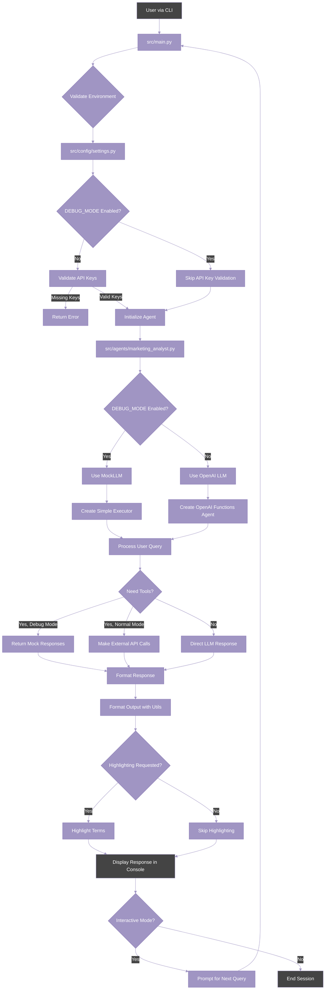

# DEBUG_MODE Feature

## Description

The DEBUG_MODE feature is a development and testing utility that allows the Marketing Analyst Agent to run without requiring actual API keys or external service connections. It provides a simulated environment with mock responses, enabling developers to test and develop the agent without needing to set up real API credentials.

## Purpose

The primary purposes of the DEBUG_MODE feature are:

1. **Simplified Development**: Enable developers to work on the agent without needing to obtain or configure API keys
2. **Offline Testing**: Allow testing of agent functionality without internet connectivity or API calls
3. **Consistent Testing Environment**: Provide deterministic responses for reliable testing
4. **Rapid Prototyping**: Accelerate the development cycle by removing external dependencies
5. **Demo Capability**: Enable demonstrations without exposing real API credentials

## Implementation Architecture



## Key Components

### 1. Environment Variable Configuration

The DEBUG_MODE is controlled by an environment variable that can be set in the `.env` file or system environment.

**Code Example - Settings Configuration**:

```python
# From src/config/settings.py
# Debug Mode - set to True to bypass API key validation
DEBUG_MODE = os.getenv("DEBUG_MODE", "true").lower() == "true"
```

### 2. API Key Validation Bypass

When DEBUG_MODE is enabled, the validation of required API keys is skipped, allowing the agent to run without them.

**Code Example - Validation Logic**:

```python
# From src/config/settings.py
def validate_env() -> Dict[str, str]:
    """
    Validate that all required environment variables are set.

    Returns:
        Dict[str, str]: Dictionary of missing or invalid environment variables
    """
    issues = {}

    # Skip validation if in DEBUG_MODE
    if DEBUG_MODE:
        return issues

    if not OPENAI_API_KEY:
        issues["OPENAI_API_KEY"] = "Missing OpenAI API key"

    # Additional validation checks...

    return issues
```

### 3. Mock LLM Implementation

The agent uses a mock implementation of the Language Model interface when DEBUG_MODE is enabled, returning predefined responses.

**Code Example - MockLLM Class**:

```python
# From src/agents/marketing_analyst.py
class MockLLM(LLM):
    """A mock LLM that returns predefined responses for debugging purposes."""

    def _call(self, prompt: str, **kwargs) -> str:
        """Return a mock response."""
        logger.info(f"DEBUG MODE: Using mock LLM response for prompt: {prompt[:100]}...")

        # Return a simple response that just tells the user what tools would be used
        if "mobile gaming" in prompt.lower():
            return """Based on the market trend analysis tool, here are the key trends in the mobile gaming market:

1. Increasing mobile engagement - More users are spending longer sessions on mobile games, with average session times increasing by 15% year over year.

2. Greater emphasis on sustainability - Game developers are focusing on sustainable monetization models that prioritize player retention over short-term revenue.

3. Shift toward personalized experiences - Games are increasingly using player data to create customized gameplay experiences and recommendations.

4. Integration of AI-driven analytics - Developers are leveraging AI tools to understand player behavior and optimize game mechanics.

The mobile gaming market has shown a growth rate of 12.5% over the past year, with a current market size of $8.7 billion. This growth is expected to continue as mobile devices become more powerful and 5G adoption increases.
"""
        elif "competitor" in prompt.lower():
            return "I would analyze this using the competitor analysis tool to provide insights on market positioning, strengths, and weaknesses."
        # Additional response patterns...
        else:
            return "I'd need to analyze this request further. Could you provide more details about what specific marketing insights you're looking for?"

    @property
    def _llm_type(self) -> str:
        return "mock_llm"
```

### 4. Simplified Agent Executor

In DEBUG_MODE, the agent uses a simplified executor that directly calls the mock LLM instead of using the more complex OpenAI functions agent.

**Code Example - Simplified Executor**:

```python
# From src/agents/marketing_analyst.py
def _create_debug_agent_executor(self):
    """Create a simplified agent executor for debug mode that just calls the mock LLM."""

    def simple_executor(inputs):
        query = inputs.get("input", "")
        # Simply call the LLM and return the output
        response = self.llm(query)
        return {"output": response}

    return simple_executor
```

### 5. Agent Setup Logic

The agent initialization logic checks the DEBUG_MODE to determine whether to use real or mock components.

**Code Example - Agent Setup**:

```python
# From src/agents/marketing_analyst.py
def _setup_agent(self) -> None:
    """Set up the agent with tools, prompt, and memory."""
    # Initialize the language model
    model_kwargs = settings.get_model_kwargs()

    # Use mock LLM in debug mode
    if settings.DEBUG_MODE:
        logger.info("Running in DEBUG MODE with mock LLM")
        self.llm = MockLLM()
    else:
        self.llm = ChatOpenAI(
            model=self.model_name,
            temperature=model_kwargs["temperature"],
            max_tokens=model_kwargs["max_tokens"],
            api_key=settings.OPENAI_API_KEY,
        )

    # Initialize the tools
    self.tools = self._get_tools()

    # Initialize the memory
    self.memory = ConversationBufferMemory(
        memory_key="chat_history",
        return_messages=True
    )

    # Initialize the prompt
    self.prompt = ChatPromptTemplate.from_messages([
        SystemMessage(content=MARKETING_ANALYST_SYSTEM_PROMPT),
        MessagesPlaceholder(variable_name="chat_history"),
        HumanMessage(content="{input}"),
        MessagesPlaceholder(variable_name="agent_scratchpad"),
    ])

    # Create the agent (simplified in DEBUG_MODE)
    if settings.DEBUG_MODE:
        # In DEBUG mode, we'll skip the OpenAI functions agent creation
        # and create a simple agent executor that just runs the mock LLM
        self.agent = RunnablePassthrough()
        self.agent_executor = self._create_debug_agent_executor()
    else:
        # Normal agent setup
        self.agent = create_openai_functions_agent(
            llm=self.llm,
            tools=self.tools,
            prompt=self.prompt
        )

        # Create the agent executor
        self.agent_executor = AgentExecutor(
            agent=self.agent,
            tools=self.tools,
            memory=self.memory,
            verbose=self.verbose,
            handle_parsing_errors=True,
        )
```

### 6. Response Formatting

The CLI uses formatting utilities to improve the readability of responses, with optional highlighting of key terms.

**Code Example - Response Formatting in Main**:

```python
# From src/main.py
if args.query:
    logger.info(f"Running query: {args.query}")
    response = agent.run(args.query)

    formatted_response = format_cli_response(response["response"])
    if args.highlight:
        formatted_response = highlight_text(formatted_response, args.highlight)

    print(formatted_response)
else:
    run_interactive_mode(agent, args.highlight)
```

## Usage with Convenience Script

The DEBUG_MODE can be used with the provided `run_agent.sh` convenience script:

```bash
# Run in debug mode with highlighting
./run_agent.sh -q "Analyze mobile gaming market trends" -h growth trends revenue

# Run in interactive debug mode
./run_agent.sh -i
```

## CLI Usage Examples with DEBUG_MODE

### Using Command Line Arguments

```bash
# Ensure DEBUG_MODE=true in .env, then run:
python -m src.main --query "What are the key trends in the mobile gaming market?"

# With highlighting
python -m src.main --query "What are the key trends in the mobile gaming market?" --highlight "trends" "mobile" "growth"

# Interactive mode with DEBUG_MODE
python -m src.main
```

### Using the Simple Test Script

A simple test script is included that automatically enables DEBUG_MODE:

```bash
python test_agent.py
```

This will run a sample query through the agent with DEBUG_MODE enabled and display the results.

## Transition to Production Mode

When ready to switch from DEBUG_MODE to production mode:

1. Set `DEBUG_MODE=false` in your `.env` file
2. Ensure all required API keys are properly set
3. Run the agent as usual with the command line interface

Debug mode provides a safe environment for development and testing, while the transition to production mode is as simple as changing an environment variable and adding the necessary API keys.

## Comprehension Questions

1. What is the primary purpose of DEBUG_MODE in the Marketing Analyst Agent?
   a) To increase the speed of agent responses
   b) To allow the agent to run without requiring API keys
   c) To provide more detailed error logs
   d) To limit the agent's functionality for security reasons

2. How is DEBUG_MODE controlled in the application?
   a) Through a command-line flag when running the agent
   b) By modifying the source code directly
   c) Through an environment variable that can be set in the .env file
   d) It's automatically enabled when running unit tests

3. What component is replaced with a mock implementation when DEBUG_MODE is enabled?
   a) The database connection
   b) The language model (LLM)
   c) The API server
   d) The agent's memory system

4. How does the agent executor behave differently in DEBUG_MODE?
   a) It runs faster by skipping validation steps
   b) It directly calls the mock LLM instead of using the OpenAI functions agent
   c) It processes multiple queries in parallel
   d) It caches responses to speed up repeated queries

5. What should you modify to add more mock responses for different query types?
   a) The .env file
   b) The \_call method in the MockLLM class
   c) The validation_env function in settings.py
   d) The agent_executor in the MarketingAnalystAgent class

**Answers:**

1. b) To allow the agent to run without requiring API keys - This is the main purpose of DEBUG_MODE.
2. c) Through an environment variable that can be set in the .env file - DEBUG_MODE is controlled via the DEBUG_MODE environment variable.
3. b) The language model (LLM) - In debug mode, MockLLM is used instead of the real OpenAI LLM.
4. b) It directly calls the mock LLM instead of using the OpenAI functions agent - This simplifies the execution flow in debug mode.
5. b) The \_call method in the MockLLM class - This is where the mock responses are defined based on query patterns.
