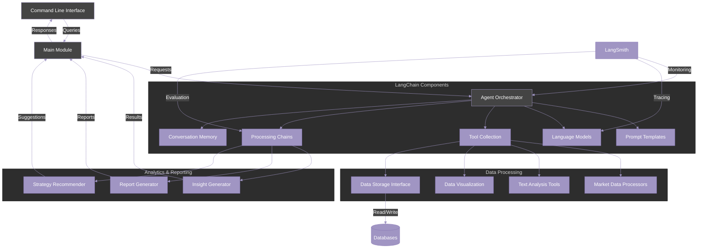

# Marketing Analyst Agent

## Description

The Marketing Analyst Agent is an AI-powered solution that automates marketing analysis tasks traditionally performed by human analysts. Built using Langchain and LangSmith, this agent can process large volumes of marketing data, extract insights, generate reports, and recommend strategies based on market trends and consumer behavior patterns.

## Purpose

The primary purpose of this agent is to:

1. Reduce the manual effort involved in marketing data analysis
2. Provide faster, data-driven insights for marketing decision-making
3. Scale marketing analysis capabilities without proportionally increasing human resources
4. Ensure consistent methodology in analyzing marketing performance
5. Identify patterns and opportunities that might be missed by human analysts

## System Architecture



## Key Features

- Data collection and preprocessing from multiple marketing sources
- Automated market trend analysis
- Consumer sentiment analysis
- Competitor analysis
- Campaign performance evaluation
- ROI calculation and forecasting
- Strategy recommendation generation
- Customizable reporting dashboards
- Integration with existing marketing tools

## Command Line Interface

The agent can be accessed via a command-line interface that supports both single-query and interactive modes:

### Single-Query Mode

```bash
python -m src.main --query "Analyze market trends in the mobile gaming industry"
```

### Interactive Mode

```bash
python -m src.main
```

## Development Roadmap

1. Core agent framework implementation
2. Data connectors for common marketing platforms
3. Basic analysis capabilities
4. Advanced analytics and reporting features
5. Strategy recommendation engine
6. Data visualization components
7. Advanced CLI features
