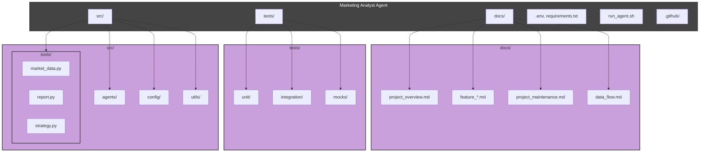

# Project Maintenance Guide

## Purpose

This document provides a comprehensive guide to maintaining the Marketing Analyst Agent project, ensuring consistency in code quality, documentation, and project structure. Following these guidelines will help keep the project well-organized, maintainable, and accessible to new contributors.

## Project Structure

The Marketing Analyst Agent follows a modular structure that separates concerns and promotes maintainability:

### Key Components

1. **src/**: Contains all source code for the agent

   - **agents/**: Agent definitions and orchestration logic
   - **tools/**: Individual marketing analysis tools
   - **config/**: Configuration settings management
   - **utils/**: Helper functions and utilities

2. **docs/**: Comprehensive documentation

   - Feature-specific documentation
   - Architecture overviews
   - Workflow diagrams

3. **tests/**: Complete test suite

   - Unit tests
   - Integration tests
   - Mock data and fixtures

4. **Configuration Files**:

   - **.env**: Environment variables (not versioned)
   - **.env.example**: Template for environment setup
   - **requirements.txt**: Dependencies

5. **GitHub Files**:
   - Issue templates
   - PR templates
   - Workflows (if applicable)

## Documentation Standards

All project documentation follows these standards:

1. **Feature Documentation**

   - Each feature has a dedicated markdown file in the docs/ folder
   - File naming convention: feature_name.md
   - Every feature document includes:
     - Detailed description
     - Purpose statement
     - Mermaid diagram using theme colors (dark gray and light purple)
     - Usage examples

2. **Code Documentation**

   - All functions and classes include docstrings
   - Complex code sections have inline comments
   - README.md provides installation and usage instructions
   - CHANGELOG.md tracks version history

3. **Diagrams**
   - Use Mermaid for all diagrams
   - Maintain consistent style (dark gray and light purple theme)
   - Include diagrams for architecture, data flow, and component interactions

## Development Workflow

### Adding New Features

1. **Planning**

   - Create GitHub issue describing the feature
   - Discuss implementation approach if needed

2. **Implementation**

   - Create feature branch from main (`feature/feature-name`)
   - Implement code following project structure
   - Write tests for the new feature
   - Add documentation in docs/feature_name.md

3. **Documentation**

   - Update README.md if needed
   - Add feature to CHANGELOG.md under [Unreleased]
   - Ensure code has proper docstrings

4. **Testing**

   - Run all tests locally
   - Ensure test coverage meets standards

5. **Pull Request**
   - Create PR using template
   - Reference the issue number
   - Wait for review and address feedback

### Bug Fixes

1. **Issue Creation**

   - Create GitHub issue describing the bug
   - Include steps to reproduce

2. **Implementation**

   - Create fix branch from main (`fix/bug-description`)
   - Implement fix
   - Add tests that would have caught the bug

3. **Documentation**

   - Update CHANGELOG.md under [Unreleased]
   - Update documentation if the fix changes behavior

4. **Pull Request**
   - Create PR using template
   - Reference the issue number
   - Ensure all tests pass

## Release Process

1. **Prepare Release**

   - Move entries from [Unreleased] to new version in CHANGELOG.md
   - Update version numbers in relevant files

2. **Create Release**

   - Merge release PR to main
   - Tag the release with version number
   - Create GitHub release with notes from CHANGELOG

3. **Post-Release**
   - Create new [Unreleased] section in CHANGELOG.md
   - Announce release if applicable

## Code Quality Standards

1. **Style**

   - Follow PEP 8 guidelines
   - Use Black for formatting
   - Maximum line length: 88 characters

2. **Testing**

   - All new code must have tests
   - Maintain at least 80% test coverage
   - Include both unit and integration tests

3. **Security**
   - No credentials in code
   - Validate all user inputs
   - Follow principle of least privilege

## Contribution Guidelines

Contributors should:

1. Read CONTRIBUTING.md before starting
2. Follow the Code of Conduct
3. Check existing issues before creating new ones
4. Use issue templates and PR templates
5. Keep PRs focused on single features or fixes
6. Write clear commit messages
7. Update documentation for all changes

## Maintenance Tasks

Regular maintenance includes:

1. **Dependency Updates**

   - Regularly check for dependency updates
   - Test thoroughly before updating in main

2. **Documentation Reviews**

   - Periodically review documentation for accuracy
   - Update as the project evolves

3. **Test Suite Maintenance**

   - Keep tests up to date
   - Improve coverage where possible

4. **Technical Debt**
   - Regularly address technical debt
   - Refactor code when necessary

## Troubleshooting Common Issues

1. **Environment Setup**

   - Ensure all required environment variables are set
   - Check virtual environment is activated

2. **Dependency Issues**

   - Try removing and reinstalling dependencies
   - Check for version conflicts

3. **Test Failures**
   - Isolate failing tests
   - Check for environment-specific issues
