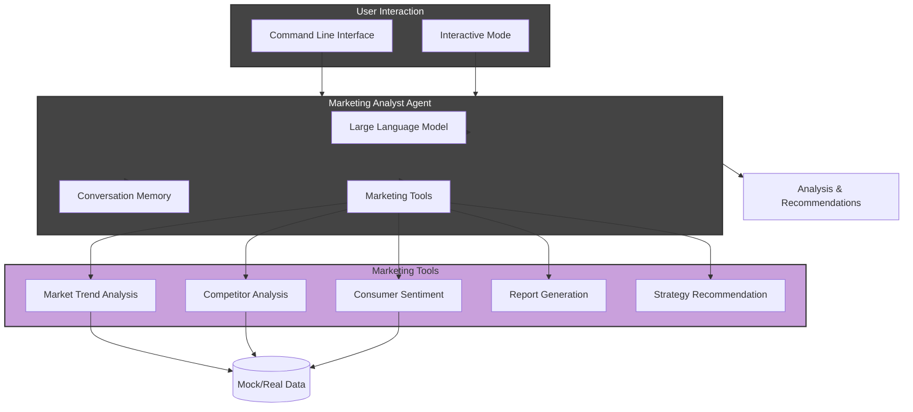

# Marketing Analyst Agent: Project Overview

## Executive Summary

The Marketing Analyst Agent is an AI-powered tool built with Python and LangChain that automates marketing analysis tasks through a command-line interface. It leverages large language models to analyze market trends, evaluate competitors, assess consumer sentiment, generate reports, and provide strategic recommendations - effectively augmenting or replacing traditional marketing analyst functions with AI capabilities.

## Purpose

This tool addresses several key challenges in marketing analysis:

1. The high cost of professional marketing analysts
2. The time-intensive nature of data collection and analysis
3. The need for data-driven decision making in marketing
4. The challenge of generating consistent, objective insights from diverse data sources

## Architecture Overview

## Key Features and Capabilities

The Marketing Analyst Agent provides several specialized capabilities:

### 1. Market Trend Analysis

- Analyzes trends in specific market segments
- Provides data on growth rates and market size
- Identifies key emerging trends affecting the market
- Evaluates market performance over specified time periods

### 2. Competitor Analysis

- Evaluates competitors' market positions and market share
- Identifies competitors' strengths and weaknesses
- Analyzes competitive strategies and positioning
- Provides comparative analysis across multiple competitors

### 3. Consumer Sentiment Analysis

- Analyzes how consumers feel about products or brands
- Evaluates sentiment across different channels (social media, reviews, surveys)
- Identifies key drivers of positive and negative sentiment
- Tracks sentiment changes over time

### 4. Report Generation

- Compiles comprehensive marketing reports
- Supports customized report sections and formats
- Integrates data from multiple analysis tools
- Generates professional summaries and visualizations

### 5. Strategy Recommendations

- Provides actionable strategic recommendations
- Suggests tactics based on market and competitor analysis
- Develops recommendations aligned with business objectives
- Prioritizes opportunities based on data-driven insights

## Technical Implementation

### Core Components

1. **Command-Line Interface**: Supports both one-time queries and interactive mode
2. **Agent Core**: Powered by OpenAI language models with specialized marketing prompts
3. **Tool Suite**: Custom LangChain tools for different marketing analysis functions
4. **Memory System**: Conversation memory for context-aware responses
5. **Debug Mode**: Mock responses for development without API costs

### Notable Features

1. **LangSmith Integration**: Optional tracing for monitoring and evaluation
2. **Flexible Configuration**: Configurable model, verbose output, and term highlighting
3. **Shell Script Wrapper**: Convenient environment and dependency management
4. **Documentation**: Comprehensive documentation of all components

## Use Cases and Applications

The Marketing Analyst Agent is valuable in several contexts:

1. **Small Businesses**: Provides affordable marketing insights to businesses without dedicated marketing teams
2. **Marketing Teams**: Augments existing teams by automating routine analysis tasks
3. **Market Research**: Accelerates initial market research by generating baseline reports
4. **Educational Tool**: Demonstrates marketing concepts through interactive analysis
5. **Product Development**: Informs product decisions with market and consumer insights

## Implementation Insights

Building this project revealed several key insights:

1. **Domain-Specific AI**: Specialized prompts and tools improve accuracy in specific domains
2. **Tool Design**: Well-designed tools with clear descriptions enhance agent effectiveness
3. **Mock Data**: Using mock data during development reduces costs while maintaining functionality
4. **Agent Memory**: Conversation memory creates more natural, context-aware interactions
5. **Gradual Complexity**: Starting with basic tools and adding complexity ensures a solid foundation

## Future Directions

Potential areas for future development include:

1. **Real Data Integration**: Connecting to actual marketing data sources and APIs
2. **UI Improvements**: Adding a web interface or dashboard
3. **Tool Expansion**: Adding more specialized tools for different marketing functions
4. **Customization**: Allowing users to define custom analysis frameworks
5. **Visualization**: Improving data visualization capabilities
6. **Multi-modal Analysis**: Incorporating image and video analysis for marketing content

## Conclusion

The Marketing Analyst Agent demonstrates how AI can be applied to specialized knowledge domains. By combining large language models with purpose-built tools and domain-specific knowledge, we create systems that provide valuable insights in professional contexts, potentially transforming how marketing analysis is conducted.
