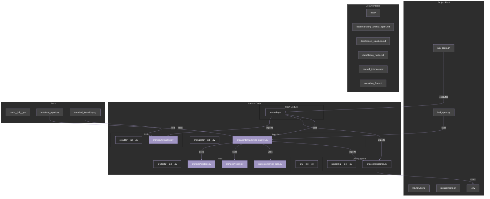

# Project Structure Documentation

## Overview

This document provides a comprehensive overview of the Marketing Analyst Agent project structure, including file organization, component relationships, and data flow patterns. Understanding this architecture is crucial for maintaining, extending, and debugging the application.

## Project Structure Diagram



## File Structure and Relationships

The Marketing Analyst Agent project follows a modular structure organized by functionality. Below is a detailed explanation of the key components and their relationships:

### 1. Root Level Files

- **README.md**: Project documentation with setup instructions and overview
- **requirements.txt**: Dependencies for the project
- **.env**: Environment configuration with API keys and settings
- **test_agent.py**: Simple script for testing the agent in debug mode
- **run_agent.sh**: Convenience shell script for running the agent

### 2. Source Code (`src/`)

The `src/` directory contains the core application code, further organized into specialized modules:

#### 2.1 Main Module (`src/main.py`)

This is the entry point for running the Marketing Analyst Agent from the command line. It:

- Parses command line arguments
- Validates the environment
- Initializes the agent
- Runs queries in either interactive or single-query mode
- Formats and displays responses

**Code Example - Entry Point**:

```python
# From src/main.py
def main() -> int:
    # Parse command line arguments
    args = parse_arguments()

    # Validate environment
    if not validate_environment():
        return 1

    logger.info(f"Initializing Marketing Analyst Agent with model: {args.model}")

    try:
        # Initialize the agent
        agent = MarketingAnalystAgent(
            model_name=args.model,
            enable_tracing=not args.no_tracing,
            verbose=args.verbose
        )

        # Run query or interactive mode
        if args.query:
            logger.info(f"Running query: {args.query}")
            response = agent.run(args.query)

            formatted_response = format_cli_response(response["response"])
            if args.highlight:
                formatted_response = highlight_text(formatted_response, args.highlight)

            print(formatted_response)
        else:
            run_interactive_mode(agent, args.highlight)

        return 0

    except Exception as e:
        logger.error(f"Error running agent: {str(e)}")
        return 1
```

#### 2.2 Configuration (`src/config/`)

- **settings.py**: Centralizes configuration settings loaded from environment variables
  - Manages API keys
  - Defines agent parameters
  - Provides validation functions
  - Supports DEBUG_MODE to bypass API key requirements

**Code Example - Settings**:

```python
# From src/config/settings.py
# Debug Mode - set to True to bypass API key validation
DEBUG_MODE = os.getenv("DEBUG_MODE", "true").lower() == "true"

# Check if required environment variables are set
def validate_env() -> Dict[str, str]:
    """
    Validate that all required environment variables are set.

    Returns:
        Dict[str, str]: Dictionary of missing or invalid environment variables
    """
    issues = {}

    # Skip validation if in DEBUG_MODE
    if DEBUG_MODE:
        return issues

    if not OPENAI_API_KEY:
        issues["OPENAI_API_KEY"] = "Missing OpenAI API key"

    if ENABLE_TRACING and not LANGSMITH_API_KEY:
        issues["LANGSMITH_API_KEY"] = "LangSmith API key required when tracing is enabled"

    return issues
```

#### 2.3 Agents (`src/agents/`)

- **marketing_analyst.py**: Implements the core MarketingAnalystAgent class
  - Sets up the LLM (or MockLLM in debug mode)
  - Configures tools, prompts, and memory
  - Creates the agent executor
  - Processes queries and returns responses

**Code Example - Agent Implementation**:

```python
# From src/agents/marketing_analyst.py
class MarketingAnalystAgent:
    """
    Marketing Analyst Agent implementation using LangChain components.
    """

    def __init__(
        self,
        model_name: str = settings.DEFAULT_MODEL,
        enable_tracing: bool = settings.ENABLE_TRACING,
        verbose: bool = True
    ):
        """Initialize the Marketing Analyst Agent."""
        self.model_name = model_name
        self.enable_tracing = enable_tracing
        self.verbose = verbose

        # Initialize LangSmith client if tracing is enabled and not in debug mode
        if self.enable_tracing and not settings.DEBUG_MODE:
            if settings.LANGSMITH_API_KEY:
                self.langsmith_client = LangSmithClient()
            else:
                logger.warning("LangSmith API key not provided, tracing disabled")
                self.enable_tracing = False

        # Initialize the agent components
        self._setup_agent()
```

**Code Example - Debug Mode Implementation**:

```python
# From src/agents/marketing_analyst.py
# Use mock LLM in debug mode
if settings.DEBUG_MODE:
    logger.info("Running in DEBUG MODE with mock LLM")
    self.llm = MockLLM()
else:
    self.llm = ChatOpenAI(
        model=self.model_name,
        temperature=model_kwargs["temperature"],
        max_tokens=model_kwargs["max_tokens"],
        api_key=settings.OPENAI_API_KEY,
    )
```

#### 2.4 Tools (`src/tools/`)

These files implement the specialized tools that the agent can use:

- **market_data.py**: Tools for analyzing market trends, competitors, and consumer sentiment
- **report.py**: Tool for generating comprehensive marketing reports
- **strategy.py**: Tool for providing strategic recommendations

**Code Example - Tool Implementation**:

```python
# From src/tools/market_data.py
class MarketTrendAnalysisTool(BaseTool):
    """Tool for analyzing market trends."""
    name: str = "market_trend_analysis"
    description: str = """
    Analyzes market trends for a specified market segment and time period.
    Use this tool when you need to understand how a market has been performing,
    identify key trends, market size, growth rate, and other relevant metrics.
    """
    args_schema: Type[BaseModel] = MarketTrendAnalysisInput

    def _run(self, market_segment: str, time_period: str, metrics: List[str]) -> Dict[str, Any]:
        """
        Run market trend analysis.

        Args:
            market_segment: The market segment to analyze
            time_period: Time period for the analysis
            metrics: Metrics to analyze

        Returns:
            Dict[str, Any]: Market trend analysis results
        """
        logger.info(f"Running market trend analysis for {market_segment} over {time_period}")

        # This would typically call an external API or database
        # For demonstration, we'll return mock data
        mock_data = {
            "market_segment": market_segment,
            "time_period": time_period,
            "metrics": {},
            "analysis_summary": ""
        }

        # Generate mock data for requested metrics
        # ... (implementation details)

        return mock_data
```

#### 2.5 Utilities (`src/utils/`)

- **formatting.py**: Output formatting utilities for the CLI
  - Formats text responses for better readability
  - Creates ASCII tables for structured data
  - Highlights specified terms in the output text

**Code Example - Formatting Utilities**:

```python
# From src/utils/formatting.py
def format_cli_response(text: str) -> str:
    """
    Format the response text for CLI output with proper spacing,
    highlighting, and breaks for readability.
    """
    # Add proper line breaks
    text = re.sub(r'(\d+\.\s[^\n]+)(?=\d+\.)', r'\1\n\n', text)

    # Add spacing after headers
    text = re.sub(r'(#+\s[^\n]+)\n', r'\1\n\n', text)

    # Add spacing for bullet points
    text = re.sub(r'(\*\s[^\n]+)(?=\*\s)', r'\1\n', text)

    return text

def highlight_text(text: str, highlights: List[str]) -> str:
    """
    Highlight specified terms in the text (when terminal supports it).
    """
    # ANSI color codes
    HIGHLIGHT_START = "\033[1;33m"  # Bold yellow
    HIGHLIGHT_END = "\033[0m"       # Reset

    result = text
    for term in highlights:
        pattern = re.compile(re.escape(term), re.IGNORECASE)
        result = pattern.sub(f"{HIGHLIGHT_START}\\g<0>{HIGHLIGHT_END}", result)

    return result
```

### 3. Tests (`tests/`)

- **test_agent.py**: Contains unit tests for the MarketingAnalystAgent
  - Uses pytest and unittest.mock for testing
  - Tests agent initialization and execution
  - Handles exceptions and error cases

**Code Example - Test Implementation**:

```python
# From tests/test_agent.py
def test_agent_run(self):
    """Test that the agent run method works correctly."""
    # Run the agent
    response = self.agent.run("Analyze market trends in the tech industry")

    # Check response
    assert isinstance(response, dict)
    assert "response" in response
    assert "success" in response
    assert response["response"] == "Mocked response from the marketing analyst agent"
    assert response["success"] is True

    # Verify the agent executor was called correctly
    self.agent.agent_executor.invoke.assert_called_once_with(
        {"input": "Analyze market trends in the tech industry"}
    )
```

### 4. Documentation (`docs/`)

- **marketing_analyst_agent.md**: Main documentation for the agent's functionality
- **project_structure.md**: This file, documenting the project structure

## Data Flow Architecture

The Marketing Analyst Agent follows a structured data flow pattern:

1. **Input Processing**:

   - User query is received via CLI (`src/main.py`) or API (`src/api/main.py`)
   - Query is validated and prepared for the agent

2. **Agent Processing**:

   - The `MarketingAnalystAgent` receives the query
   - It identifies which tools to use based on the query content
   - The appropriate tool is called with extracted parameters

3. **Tool Execution**:

   - Specialized tools process the request and generate data
   - In production mode, tools may call external APIs or databases
   - In debug mode, tools return mock data

4. **Response Generation**:
   - The agent synthesizes a response from the tool output
   - The response is formatted and returned to the user

**Example Data Flow**:

For a query about market trends, the data flows as follows:

```
User Input → main.py/api.py → MarketingAnalystAgent → MarketTrendAnalysisTool → Response
```

With the code implementation:

```python
# 1. User query received in main.py
query = "Analyze market trends in mobile gaming for Q1 2023"
response = agent.run(query)

# 2. Inside MarketingAnalystAgent.run()
def run(self, input_text: str) -> Dict[str, Any]:
    try:
        # Run the agent
        response = self.agent_executor({"input": input_text})
        return {
            "response": response["output"],
            "success": True
        }
    except Exception as e:
        logger.error(f"Error running agent: {str(e)}")
        return {
            "response": f"An error occurred: {str(e)}",
            "success": False
        }

# 3. The agent identifies and calls the MarketTrendAnalysisTool
# 4. The tool processes the request and returns data
# 5. The agent formats the final response for the user
```

## Architectural Pros and Cons

### Pros

1. **Modular Design**:

   - Clear separation of concerns between components
   - Easy to extend with new tools or agent capabilities
   - Components can be tested independently

2. **Configuration Flexibility**:

   - Environment variables control behavior
   - DEBUG_MODE allows development without API keys
   - Settings centralized in one location

3. **Multiple Interfaces**:

   - CLI for direct usage
   - API for integration with other systems
   - Supports both interactive and single-query modes

4. **Robust Error Handling**:

   - Comprehensive logging
   - Graceful failure modes
   - Error messages propagated to users

5. **Test Support**:
   - Mock implementations for testing
   - Unit test framework in place
   - Debug mode for development

### Cons

1. **Dependency Complexity**:

   - Relies heavily on external packages (Langchain, OpenAI, etc.)
   - Updates to these packages may break functionality
   - Learning curve for understanding all components

2. **Mock Data Limitations**:

   - Debug mode uses simplistic mocks
   - Lacks comprehensive testing for all scenarios
   - May not reflect real API behavior fully

3. **Limited Persistence**:

   - Basic storage configuration
   - No robust data persistence strategy
   - May need enhancement for production use cases

4. **Documentation Gaps**:

   - Some components lack detailed documentation
   - Code examples could be more comprehensive
   - More diagrams needed for complex flows

5. **API Security**:
   - Basic CORS configuration
   - Limited authentication mechanisms
   - Would need enhancement for production deployment

## Comprehension Questions

### Section 1: Project Structure

1. Which file serves as the main entry point for running the Marketing Analyst Agent from the command line?
   a) src/api/main.py
   b) src/main.py
   c) test_agent.py
   d) src/agents/marketing_analyst.py

2. What is the purpose of the .env file in the project?
   a) To store Python code that initializes environment variables
   b) To document the project environment requirements
   c) To store configuration settings like API keys and parameters
   d) To track environment-specific bugs

3. In which directory would you find tools for market trend analysis?
   a) src/config/
   b) src/tools/
   c) src/agents/
   d) src/api/

4. What happens if required API keys are missing when DEBUG_MODE is enabled?
   a) The application crashes immediately
   b) The validation fails and returns error codes
   c) The application continues to run using mock data
   d) The application prompts the user to enter the missing keys

5. Which file would you modify to add a new agent tool for social media analysis?
   a) src/main.py
   b) src/agents/marketing_analyst.py
   c) Create a new file in src/tools/
   d) src/api/main.py

**Answers:**

1. b) src/main.py - This is the main entry point for CLI usage.
2. c) To store configuration settings like API keys and parameters - The .env file contains environment variables.
3. b) src/tools/ - Tools like MarketTrendAnalysisTool are defined in the tools directory.
4. c) The application continues to run using mock data - DEBUG_MODE bypasses API key validation.
5. c) Create a new file in src/tools/ - Following the modular design, a new tool would go in the tools directory.

### Section 2: Agent Implementation

1. What class is used to simulate the LLM in debug mode?
   a) DebugLLM
   b) SimulatedLLM
   c) MockLLM
   d) TestLLM

2. How does the MarketingAnalystAgent process user queries?
   a) By directly calling the OpenAI API
   b) Through an agent executor that decides which tools to use
   c) By pattern matching against predefined query templates
   d) Using a rule-based expert system

3. What determines whether the agent uses tracing functionality?
   a) The API_LOG_LEVEL setting
   b) The ENABLE_TRACING environment variable and LangSmith API key availability
   c) Whether the application is run in debug mode only
   d) If the agent is initialized with verbose=True

4. When running in DEBUG_MODE, how does the agent executor behave differently?
   a) It processes queries faster with optimization
   b) It simply calls the mock LLM directly instead of using the OpenAI functions agent
   c) It saves all queries to a debug log
   d) There is no difference in behavior

5. What components make up the agent's prompt structure?
   a) System message, input prompt, and tool descriptions
   b) System message, chat history, human message, and agent scratchpad
   c) Just the user query and model parameters
   d) Custom templates defined in settings.py

**Answers:**

1. c) MockLLM - This class simulates LLM responses in debug mode.
2. b) Through an agent executor that decides which tools to use - The agent uses LangChain's agent executor to process queries.
3. b) The ENABLE_TRACING environment variable and LangSmith API key availability - Both are required for tracing to work.
4. b) It simply calls the mock LLM directly instead of using the OpenAI functions agent - Debug mode uses a simplified flow.
5. b) System message, chat history, human message, and agent scratchpad - These components structure the prompt for the LLM.

### Section 3: Tools and APIs

1. Which pattern do the tool implementations follow?
   a) Factory pattern
   b) Singleton pattern
   c) Base class inheritance with schema-defined inputs
   d) Strategy pattern with dependency injection

2. How does the API instantiate the MarketingAnalystAgent?
   a) It creates a new instance for each request
   b) It uses a global singleton instance created with FastAPI's dependency injection
   c) It loads the agent from a serialized file
   d) It creates temporary instances that are discarded after use

3. What response format does the `/query` endpoint use?
   a) Plain text
   b) HTML
   c) A JSON object with response, success, and metadata fields
   d) XML

4. What happens when an exception is raised during tool execution?
   a) The application crashes
   b) The exception is logged, and a failure response is returned to the user
   c) The exception is silently ignored
   d) The agent automatically retries the operation

5. How would specialized API endpoints like `/analyze/market-trends` differ from the general `/query` endpoint?
   a) They accept different input formats but function identically
   b) They format the query specifically for the relevant tool before passing to the agent
   c) They bypass the agent and call the tools directly
   d) They use different agent instances optimized for specific tasks

**Answers:**

1. c) Base class inheritance with schema-defined inputs - Tools extend BaseTool and define input schemas.
2. b) It uses a global singleton instance created with FastAPI's dependency injection - The get_agent dependency manages this.
3. c) A JSON object with response, success, and metadata fields - This structured format provides complete information.
4. b) The exception is logged, and a failure response is returned to the user - The agent handles errors gracefully.
5. b) They format the query specifically for the relevant tool before passing to the agent - They structure input for specific tools.

### Section 4: Testing and Debugging

1. What approach does the test framework use to avoid making real API calls?
   a) It disables network connections
   b) It mocks the LLM and tools
   c) It switches to a special test API
   d) It limits tests to basic functionality only

2. What environment variable controls whether the agent runs in debug mode?
   a) DEBUG
   b) DEBUG_MODE
   c) AGENT_DEBUG
   d) DEVELOPMENT_MODE

3. How does the simple test script (test_agent.py) differ from the formal tests in the tests/ directory?
   a) The simple script is for manual testing, while formal tests are for automated CI/CD
   b) The simple script tests only basic functionality, while formal tests are comprehensive
   c) The simple script uses debug mode, while formal tests use real APIs
   d) They are identical in functionality but located in different directories

4. Which assertion would verify that an agent function correctly handles exceptions?
   a) assert "error" in str(exception)
   b) assert exception.raised
   c) assert response["success"] is False
   d) assert agent.run() raises Exception

5. What type of testing does the existing test framework implement?
   a) Integration testing only
   b) Unit testing with mocks
   c) End-to-end testing
   d) Stress testing

**Answers:**

1. b) It mocks the LLM and tools - Mocking prevents actual API calls during testing.
2. b) DEBUG_MODE - This is checked in settings.py to determine the agent's behavior.
3. a) The simple script is for manual testing, while formal tests are for automated CI/CD - The test_agent.py is for quick manual testing.
4. c) assert response["success"] is False - This verifies the error handling return value structure.
5. b) Unit testing with mocks - The test framework uses unittest.mock to isolate components.

### Section 5: Architecture and Data Flow

1. What architectural pattern best describes the overall structure of the application?
   a) Microservices
   b) Model-View-Controller (MVC)
   c) Event-driven architecture
   d) Component-based modular architecture

2. In the data flow for a market trend analysis query, what is the correct sequence?
   a) User → API → Agent → Tool → Response
   b) User → Tool → Agent → API → Response
   c) API → User → Agent → Tool → Response
   d) Agent → Tool → API → User → Response

3. What aspect of the architecture makes it easy to add new analysis capabilities?
   a) The dynamic loading of tools at runtime
   b) The modular separation of tools from the agent
   c) Auto-generated code from schemas
   d) The multi-threaded execution engine

4. Which component acts as the coordination layer between user input and tool execution?
   a) src/config/settings.py
   b) src/tools/**init**.py
   c) src/agents/marketing_analyst.py
   d) src/api/main.py

5. What limitation might the current architecture face with large-scale deployment?
   a) Limited persistence strategy
   b) Single-threaded execution
   c) Fixed set of tools
   d) All of the above

**Answers:**

1. d) Component-based modular architecture - The system is organized into functional components with clear interfaces.
2. a) User → API → Agent → Tool → Response - This represents the typical data flow.
3. b) The modular separation of tools from the agent - New tools can be added without changing the agent's core code.
4. c) src/agents/marketing_analyst.py - The agent coordinates between user input and tool execution.
5. a) Limited persistence strategy - The current architecture has basic storage configuration which might be a limitation at scale.
